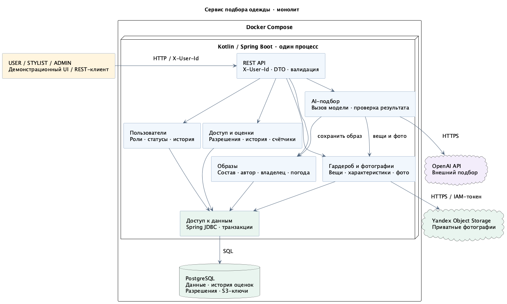

# Сервис подбора одежды

Учебный проект по [курсу высоконагруженных систем](https://github.com/Discipliny/highload_systems). Сервис поможет подбирать образы из собственного гардероба с учётом погоды.

Пользователь загружает фотографии вещей, описывает их и задаёт погодные условия. Образ можно составить вручную или с помощью OpenAI. Стилист с разрешения владельца получает доступ к гардеробу, предлагает свои образы и оценивает чужие. Администратор управляет ролями, блокирует аккаунты и модерирует контент.

## Стек

- Kotlin и Spring Boot — монолитное приложение.
- PostgreSQL — данные сервиса.
- Yandex Object Storage (S3) — фотографии.
- Spring Security и JWT — вход и проверка доступа.
- OpenAI — подбор образов.

Сейчас приложение поддерживает вход по паролю и JWT, справочники, личный гардероб с фотографиями и ручные образы с погодой. Стилист с разрешения владельца может просматривать гардероб и создавать образы клиента. Оценки и OpenAI будут добавлены позже. Модель БД ещё предстоит согласовать с преподавателем.

Хранение пользователей реализовано через Spring Data JPA. Таблицы пользователей и истории создаёт Flyway при запуске; Hibernate проверяет схему, но не меняет её. Изменение роли или статуса сохраняет предыдущую версию в той же транзакции. Административного API и регистрации пока нет.

Внутри `ru.itmo.clothesadvisor` пакеты разделены по техническим слоям, а затем по предметным областям: `model.user`, `repository.wardrobe`, `service.weather`. Вещи и их категории находятся в `wardrobe`, виды осадков — в `weather`; у каждого справочника свой сервис и контроллер. Вещь называется `WardrobeItem`, категория — `WardrobeCategory`: гардероб включает также обувь и аксессуары.

## Локальный запуск

Для запуска в контейнерах нужен Docker с Compose. Создайте локальный файл настроек:

```shell
cp .env.example .env
```

В `.env` заполните `JWT_SECRET_BASE64` и пароли `LOCAL_USER_PASSWORD`, `LOCAL_STYLIST_PASSWORD`, `LOCAL_ADMIN_PASSWORD`. Ключ можно сгенерировать командой `openssl rand -base64 32`. Ключ и пароли не нужно коммитить; `.env` исключён из Git. Пароли должны быть непустыми и занимать не более 72 байт UTF-8 — это ограничение BCrypt.

В примере включён профиль `local`: при первом запуске он создаст аккаунты `user`, `stylist` и `admin`. Повторный запуск не перезаписывает их пароли, роли или статусы. Без этого профиля автоматического создания аккаунтов нет. Ключ JWT нужен в любом профиле; приложение не запускается с отсутствующим или некорректным ключом.

Для фотографий нужен заранее созданный приватный бакет Yandex Object Storage. Заполните `S3_BUCKET`, `S3_ACCESS_KEY_ID` и `S3_SECRET_ACCESS_KEY`; без них приложение не запустится. Сервисному аккаунту нужен доступ к чтению и загрузке объектов этого бакета. Публичный доступ должен быть выключен; создание бакета и настройка его прав не входят в приложение. По умолчанию используются `S3_ENDPOINT=https://storage.yandexcloud.net` и `S3_REGION=ru-central1`, как в [документации Yandex Cloud](https://yandex.cloud/en/docs/storage/tools/aws-sdk-java). Секретный ключ храните только в окружении или локальном `.env`.

Запустите сервисы командой `docker compose up --build`.

Проверка состояния: `curl http://127.0.0.1:8080/actuator/health`. При доступной БД поле `status` имеет значение `UP`. Порты приложения и БД опубликованы только на localhost; изменить их можно через `APP_PORT` и `DB_PORT` в `.env`. Внутри контейнера приложение всегда слушает порт 8080.

Остановить сервисы можно командой `docker compose down`. Данные PostgreSQL останутся в именованном томе; следующий запуск использует их снова.

Пароль PostgreSQL из `.env.example` предназначен только для локального запуска и не является секретом.

## Вход

Получить токен можно запросом:

```shell
curl http://127.0.0.1:8080/api/auth/login \
  -H 'Content-Type: application/json' \
  -d '{"login":"user","password":"<пароль из LOCAL_USER_PASSWORD>"}'
```

Ответ содержит `accessToken`, `tokenType: "Bearer"` и `expiresIn: 1800`. Передайте токен в заголовке следующего запроса:

```shell
curl http://127.0.0.1:8080/api/auth/me \
  -H 'Authorization: Bearer <accessToken>'
```

JWT действует 30 минут, после чего нужен повторный вход. Блокировка аккаунта и изменение роли учитываются со следующим защищённым запросом, даже если токен ещё не истёк. Неверный логин, пароль или заблокированный аккаунт дают одинаковый 401; ошибочный формат запроса — 400; недостаточные права — 403. Пароль и его хеш в ответах не возвращаются.

Обычный HTTP здесь используется только для локального запуска. При публикации сервиса пароль и Bearer-токен должны передаваться через HTTPS.

## Справочники

После входа любой из трёх ролей доступны:

- `GET /api/wardrobe/categories` — категории вещей;
- `GET /api/weather/precipitation-types` — виды осадков.

Ответ — массив объектов с полями `id`, `code`, `name`, отсортированный по ID. Параметр `page` начинается с 0, `size` принимает значения от 1 до 50; по умолчанию возвращается первая страница из 50 элементов. Общее число записей не вычисляется. Некорректные параметры, в том числе слишком большое смещение страницы для JPA, дают 400; страница за концом списка — пустой массив.

```shell
curl 'http://127.0.0.1:8080/api/wardrobe/categories?page=0&size=50' \
  -H 'Authorization: Bearer <accessToken>'
```

В начальном наборе шесть категорий: верх, низ, платья и комбинезоны, верхняя одежда, обувь, аксессуары. Виды осадков: нет, дождь, снег, дождь со снегом. Значения добавляются миграцией V2 во всех профилях; API редактирования нет. Дальнейшие изменения справочников также выполняются миграциями, с сохранением ID и смысла существующих кодов.

## Гардероб

Роль USER может создавать, читать, изменять и удалять свои вещи через `/api/wardrobe/items`. Владелец берётся из JWT; передавать его ID не нужно. Чужая вещь, как и несуществующая, возвращает 404. Эти личные маршруты недоступны STYLIST и ADMIN; для чтения стилистом предусмотрены отдельные маршруты ниже.

Пример создания вещи:

```shell
curl http://127.0.0.1:8080/api/wardrobe/items \
  -H 'Authorization: Bearer <accessToken>' \
  -H 'Content-Type: application/json' \
  -d '{"name":"Футболка","categoryId":1,"color":"Белый","material":"Хлопок"}'
```

Все четыре поля обязательны; название — не более 300 символов, ID категории можно получить из справочника. Ответ 201 содержит карточку и заголовок Location. У новой вещи version равна 1, createdAt и modifiedAt задаются сервером.

- `GET /api/wardrobe/items?page=0&size=50` — список своих вещей по ID, без total; size от 1 до 50.
- `GET /api/wardrobe/items/{id}` — карточка вещи.
- `PUT /api/wardrobe/items/{id}` — полная замена названия, категории, цвета и материала; в JSON нужно добавить текущую version.
- `DELETE /api/wardrobe/items/{id}?version=…` — физическое удаление, ответ 204.

Устаревшая версия возвращает 409. Изменение сохраняет предыдущие значения в истории, удаление — последнее состояние; это происходит в одной транзакции. Повторная отправка тех же значений с актуальной версией ничего не меняет. Вещь, входящую в образ, удалить нельзя — сервис вернёт 409. Отдельного API истории пока нет.

## Фотографии

У вещи может быть до пяти фотографий JPEG/PNG, каждая до 10 МБ (10 000 000 байт). Сначала можно создать карточку, затем добавить фотографии:

```shell
curl http://127.0.0.1:8080/api/wardrobe/items/1/photos \
  -H 'Authorization: Bearer <accessToken>' \
  -F 'photos=@shirt.jpg' -F 'photos=@shirt-back.png'
```

Либо создать карточку сразу с фото тем же `POST /api/wardrobe/items`, передав multipart-часть `item` с JSON и файлы `photos`:

```shell
curl http://127.0.0.1:8080/api/wardrobe/items \
  -H 'Authorization: Bearer <accessToken>' \
  -F 'item={"name":"Футболка","categoryId":1,"color":"Белый","material":"Хлопок"};type=application/json' \
  -F 'photos=@shirt.jpg'
```

JSON-создание без фото остаётся доступным. Список фото — `GET /api/wardrobe/items/{itemId}/photos`, сам файл — `GET /api/wardrobe/items/{itemId}/photos/{photoId}/content`, удаление — `DELETE /api/wardrobe/items/{itemId}/photos/{photoId}`. Для всех запросов нужен JWT владельца. Список содержит id, itemId, contentType, sizeBytes и createdAt; ключей и ссылок S3 в ответе нет.

Удаление фото или вещи убирает метаданные из БД. Файлы остаются в приватном S3, но получить их через сервис уже нельзя; восстановления и автоочистки нет. Замена фото — удаление и новая загрузка, без изменения версии карточки. Ошибка S3 возвращает 503; слишком большой файл — 413, неподдерживаемый формат — 415, превышение лимита сохранённых фото — 409. Заголовок изображения проверяется без полного декодирования пикселей.

Загрузка S3 и запись БД не являются общей транзакцией: при сбое могут остаться приватные объекты без метаданных. Частично созданных карточек или списков фото в БД не остаётся. Уже скачанные клиентом фотографии отозвать невозможно.

## Доступ стилистов

USER может предоставить стилисту доступ по его ID — общего поиска пользователей пока нет. Владелец разрешения определяется по JWT. Разрешение единое для гардероба и образов:

- `PUT /api/me/stylist-access/{stylistId}` — выдать доступ активному STYLIST;
- `DELETE /api/me/stylist-access/{stylistId}` — отозвать доступ;
- `GET /api/me/stylist-access` — свои выданные разрешения;
- `GET /api/stylist/clients` — доступные текущему стилисту клиенты.

PUT и DELETE возвращают 204, в том числе при повторе; повторный PUT требует, чтобы адресат по-прежнему был активным стилистом. Неизвестный или неподходящий адресат при выдаче — 404. Отозвать разрешение можно и после блокировки или смены роли адресата. Списки возвращают только id и login, по возрастанию ID, с обычной пагинацией page/size (0/50 по умолчанию, до 50 записей, без total).

Стилист читает вещи клиента через `GET /api/stylist/clients/{ownerId}/wardrobe/items`. К этому пути добавляются `/{itemId}` для карточки, `/{itemId}/photos` для списка фото и `/{itemId}/photos/{photoId}/content` для файла. DTO и заголовки фотографии такие же, как в личном API. Изменять вещи или фотографии клиента стилист не может.

Доступ действует только между ACTIVE USER и ACTIVE STYLIST. Блокировка или смена роли сохраняет разрешение, но приостанавливает доступ; после восстановления роли и статуса он возвращается автоматически. Пользователь видит все свои сохранённые разрешения, стилист — только доступных сейчас клиентов.

Нет разрешения, владелец недоступен, вещь или фото не принадлежат указанному клиенту — одинаковый 404 без подробностей. Без действительного JWT — 401, при неподходящей роли вызывающего — 403. После скачивания из S3 сервис повторно проверяет разрешение, роли и статусы обоих участников: отзыв, завершившийся во время загрузки, закрывает выдачу файла. Уже отправленные байты отозвать невозможно.

## Ручные образы

USER создаёт образ из своих вещей через `POST /api/outfits`:

```json
{
  "name": "На прогулку",
  "itemIds": [1, 2],
  "weather": {
    "temperatureC": 12.5,
    "precipitationTypeId": 1,
    "windSpeedMps": 3.2
  }
}
```

Название — непустая строка до 300 символов. В составе от 1 до 50 разных вещей владельца, фотографии не обязательны. Порядок вещей сохраняется. Температура и ветер — десятичные числа, ветер не может быть отрицательным; вид осадков берётся из справочника.

Ответ 201 содержит карточку и Location. В карточке — id, ownerId, authorId, source, name, itemIds, weather и createdAt. Владелец, автор и источник определяются сервером. Сохранённый образ нельзя редактировать: для другого состава создайте новый.

- `GET /api/outfits?page=0&size=50` — свои образы, новые первыми по ID; size от 1 до 50. Общее количество — в заголовке X-Total-Count.
- `GET /api/outfits/{id}` — карточка образа.
- `DELETE /api/outfits/{id}` — удалить свой образ, ответ 204. Вещи сохраняются.

Стилист использует `POST/GET /api/stylist/clients/{ownerId}/outfits` и `GET /api/stylist/clients/{ownerId}/outfits/{id}`. Требуется действующее разрешение клиента. Клиент остаётся владельцем образа; стилист становится автором, source — STYLIST. Права удаления у стилиста нет.

Ошибочные данные и неизвестные осадки дают 400; недоступные вещи, образ или клиент — 404; конфликт сохранения — 409. Частичный образ без состава или погоды не сохраняется. AI-подбор и оценки в эти маршруты пока не входят.

## Сборка и тесты

Для локальной сборки нужен JDK 25. Gradle устанавливать отдельно не требуется:

```shell
./gradlew bootJar
./gradlew test
```

JAR появится в `build/libs/`. Тестам нужен работающий Docker: Testcontainers самостоятельно запускает отдельную PostgreSQL. Проверяются хранение и история пользователей, откат и конкуренция, HTTP health, вход, проверка JWT и прав, блокировка и локальные аккаунты. Тесты используют отдельные тестовые ключи и пароли, значения из `.env` им не нужны. Уже установленная БД не заменяет Docker для этих тестов.

Если используете Colima на macOS со стандартным профилем, перед командами Docker и тестами настройте окружение:

```shell
colima start
export DOCKER_HOST="unix://${HOME}/.colima/default/docker.sock"
export TESTCONTAINERS_DOCKER_SOCKET_OVERRIDE=/var/run/docker.sock
```

## Документация

- [Требования к первой лабораторной работе](docs/requirements.md)
- [Архитектура — PlantUML](docs/architecture.puml) · [PNG](docs/architecture.png) · [SVG](docs/architecture.svg)
- [ER-модель данных — PlantUML, Crow's Foot](docs/domain.puml) · [PNG](docs/domain.png) · [SVG](docs/domain.svg)


